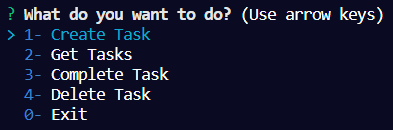
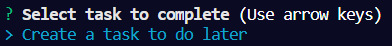
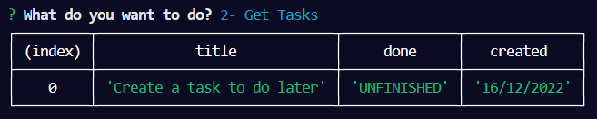
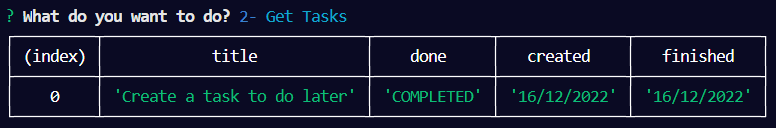
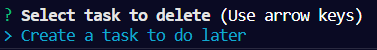

# node-todoApp

# HOW TO INSTALL DEPENDENCES

- Clone the repository
  `git clone https://github.com/Gabbal/node-todoApp.git`

- go to directory `cd node-todoApp `
- Run `npm install`
- Run `node index`

# PACKAGES

- [UUID](https://www.npmjs.com/package/uuid) (To assign id to the tasks)
- [Inquirer](https://www.npmjs.com/package/inquirer) (Core of the App to work it on the console)
- [Colors](https://www.npmjs.com/package/colors) (help us to make the app less monotone)

# HOW TO USE

- After you run `node index`, you will have this menu:

    

- create a task adding the title.

    

- Get Tasks to see your TODO.

    

- Complete Task to finish the TODO.

    

- View of completed task.

    

- Delete a task you don't want.

    